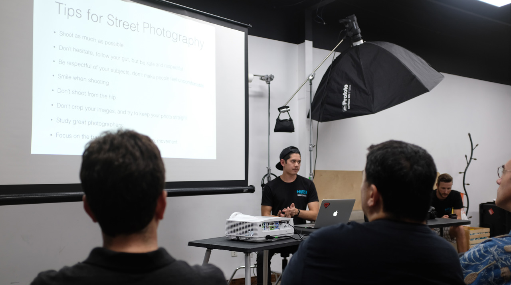

I am a Software Developer with over a decade of web development experience, working with Ruby/Ruby on Rails, JavaScript, and Go. I currently work remotely at Real Geeks/Fidelity National Finance as a Full Stack Software Developer -- previously I worked at Hawaii Camera and Buoy Alarm, both in an engineering role.

I love learning as much as I can about programming and languages, and sharing my knowledge. I'm also an advocate of pair programming, which I believe offers a way to learn and teach simultaneously and produce quality code. I owe my career to open source and I try my best to contribute back. Check out [my github](https://github.com/aaronvb) to see what I'm currently up to.

When I'm not coding, I'm most likely climbing with my wife and friends or out taking photos on the streets.

*Street Photography Workshop, May 2017*

*PK's on Maui, March 2020*