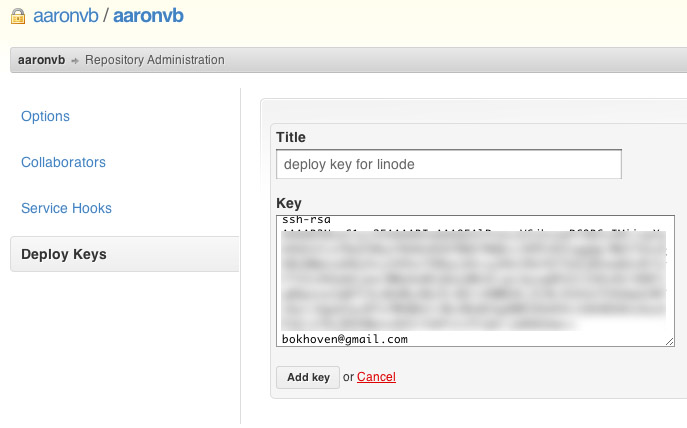

I just recently fired up a new Linode VPS, with Ubuntu 10.04 LTS, to stage a Ruby on Rails 3.1 app running Ruby 1.9.2 and I thought I would share my process. Total time took about 1 hour. I'm also going to share my deploy method using Github and Capistrano.

Just for reference, this is what's going to be installed:

Git
RVM
Ruby 1.9.2
Ruby on Rails 3.1
sqlite3
Apache 2
Passenger

So the first thing to do is make sure you have your Ubuntu server setup properly with SSH and and all Ubuntu updates. I followed these steps: [articles.slicehost.com/2010/4/30/ubuntu-lucid-setup-part-1](https://web.archive.org/web/20180415154920/http://articles.slicehost.com/2010/4/30/ubuntu-lucid-setup-part-1). Also make sure you know your root password as we'll need to `su` back into root later on.

Once you have that done, the second article should end after you update. Next install Git.

```console
$ sudo aptitude build-dep git-core
$ mkdir ~/sources
$ cd ~/sources
$ wget http://git-core.googlecode.com/files/git-1.7.7.2.tar.gz
$ tar xvzf git-1.7.7.2.tar.gz
$ cd git-1.7.7.2
$ ./configure
$ make
$ sudo make install
```

You can verify the installation by typing:

```console
$ git --version
```

After git is installed, we need to get the packages for Ruby 1.9.2 to be compatible with Rails 3.1.

```console
$ sudo apt-get install openssl libssl-dev libreadline5-dev zlib1g-dev libncurses5-dev
```

Next we need to log into root to install RVM.

```console
$ su
$ bash < <(curl -s https://raw.github.com/wayneeseguin/rvm/master/binscripts/rvm-installer )
```

Once RVM is installed, time to install Ruby 1.9.2. Make sure you're still logged in as root(through su). You'll need to source the RVM script every time you log into root. Normally you wont be doing this often enough to have it auto load, but you can if you want to.

```console
$ source /usr/local/rvm/scripts/rvm
```

Now you should have access to the command: `rvm`

Install packages for Ruby 1.9.2 that Rails 3.1 will require.

```console
$ rvm pkg install readline
$ rvm pkg install iconv
$ rvm pkg install openssl
```

Now you can install Ruby 1.9.2

```console
$ rvm install 1.9.2 -C --with-openssl-dir=/usr/local/rvm/usr,--with-iconv-dir=/usr/local/rvm/usr,--with-readline-dir=/usr/local/rvm/usr
```

Once that's finished, set Ruby 1.9.2 as the system default.

```console
$ rvm use 1.9.2 --default
```

Then exit root su.

```console
$ exit
```

You should be back to your normal user. Check to make sure rvm is loaded by typing 'rvm'. If nothing happens exit SSH and log back in. At this point, Ruby should be installed:

```console
$ ruby -v
-> ruby 1.9.2p290 (2011-07-09 revision 32553) [i686-linux]
```

Next install Bundler.

```console
$ rvmsudo gem install bundler
```

Before continuing, make sure your project is on a github repository.

To be able to deploy the code from your github repo to this server, you need to have an rsa key that will be added to your github repository deploy key setting.

```console
$ cd ~/.ssh
$ ssh-keygen -t rsa -C "youremailaddress@whatever.com"
```

Once that's done, copy the contents of the `id_rsa.pub `key.

```console
$ cat id_rsa.pub
```

The output should look like: `ssh-rsa AASasdnl31nADLKAnrqppq...oeqnAE1== youremailaddress@whatever.com`

Copy that to your github project deploy key:



You can verify that you did it correctly:

```console
$ ssh -T git@github.com
-> Hi aaronvb! You've successfully authenticated, but GitHub does not provide shell access.
```

Next, Ubuntu dependencies for sqlite3:

```console
$ sudo apt-get install sqlite3 libsqlite3-dev
```

The next steps will be on your LOCAL computer. If you already have your own way of deployment you can skip this. Install capistrano, or update to the latest version, and update to the newest bundler. The reason why you need the latest bundler is so that capistrano can work with the new asset pipeline in Rails 3.1. Let me explain how this can work.

You have two options when deploying your app with the new asset pipeline. Compile your assets locally and include the files in your push to your repository, then deploy normally. Second option, push your code as you normally would to your repository, deploy, and have your assets compile on your server instead of locally. The later is the default way capistrano will handle the deploy, and in my opinion is the easiest way.

`On your LOCAL computer:`

```console
$ gem install capistrano
$ gem install bundler
```

Setup capistrano in your app:

```console
$ cd your/app/
$ capify .
```

Next, change capistrano settings to allow asset pipeline and RVM support. In your app directory, open up the file: `Capfile `and change it to look like this:

```ruby
load 'deploy' if respond_to?(:namespace) # cap2 differentiator

# Uncomment if you are using Rails' asset pipeline
load 'deploy/assets'

Dir['vendor/gems/*/recipes/*.rb','vendor/plugins/*/recipes/*.rb'].each { |plugin| load(plugin) }

load 'config/deploy' # remove this line to skip loading any of the default tasks

$:.unshift(File.expand_path('./lib', ENV['rvm_path'])) # Add RVM's lib directory to the load path.
require "rvm/capistrano"                  # Load RVM's capistrano plugin.
```

Next configure the capistrano deploy file by opening: `your/app/config/deploy.rb`. I've provided my `deploy.rb` as a reference:

```ruby
set :application, "aaronvb"
set :repository,  "git@github.com:aaronvb/aaronvb.git"

set :deploy_to, "~/sites/#{application}"

set :scm, "git"
set :branch, "master"

set :user, "aaronvb"

role :app, "yourserverip:yourserverportforssh"
role :web, "yourserverip:yourserverportforssh"
role :db,  "yourserverip:yourserverportforssh", :primary => true

# if you're still using the script/reaper helper you will need
# these http://github.com/rails/irs_process_scripts

namespace :deploy do
  desc "Restarting Passenger with restart.txt"
  task :restart, :roles => :app, :except => { :no_release => true } do
    run "touch #{current_path}/tmp/restart.txt"
  end

  [:start, :stop].each do |t|
    desc "#{t} task is a no-op with mod_rails"
    task t, :roles => :app do ; end
  end
end
```

Now to setup the directories for capistrano on  your server. `Still on your LOCAL computer`:

```console
$ cap deploy:setup
$ cap deploy:check
-> You appear to have all necessary dependencies installed
```

Now to deploy JUST the code from your github repository:

```console
$ cap deploy:update_code
```

Once that finishes, go back to your SERVER. Your app should now be residing in the folder you setup within the capistrano `deploy.rb` file. Go to that directory. If you used my `deploy.rb` then it will be in `~/sites/yourappname/`.

When you find it, go to `/releases/` and go to the only folder in there. It should be a folder named with numbers(datetime stamp of the latest deploy). In that folder you should see your app code from your github repository. The way capistrano works is that every time you deploy your code, it uploads it to a new folder in `/releases/` which will be named by a datetime stamp, and then linked to `/yourappname/current`.

So at this point you should be sitting in your app root directory on your server. The next step is to get your apps gems installed, easy:

```console
$ bundle install
```

After that finishes, time to install node.js. This is required to compile the assets for the asset pipeline in Rails 3.1. If you decided to compile your assets on your local computer, you can skip this. I followed the instruction from: [github.com/joyent/node/wiki/Installing-Node.js-via-package-manager](https://github.com/joyent/node/wiki/Installing-Node.js-via-package-manager) for this part.

```console
$ sudo apt-get install python-software-properties
$ sudo add-apt-repository ppa:chris-lea/node.js
$ sudo apt-get update
$ sudo apt-get install nodejs
```

If you're using sqlite as the database, you might run into a little problem when deploying. Every time you deploy, your production.db will get removed. This is because your production.db isn't in your github repository. You have a few options to handle this; have your deploy script copy the production.db from your old release to your latest release, or place your production.db outside of your releases. I use the later option. To do this I created the folder: `/sites/yourappname/db/` and in my `database.yml` config file I changed the path for the production database to: `database: /home/yourserverusername/sites/yourappname/db/production.sqlite3`.

Time to set the database up in your app. Change directories back to your project.

```console
$ rake db:create RAILS_ENV=production
$ rake db:migrate RAILS_ENV=production
```

You can test your app now by trying the console: `$ rails c production`.

Installing Apache 2 and Passenger:

```console
$ sudo aptitude install apache2
$ rvmsudo gem install passenger
$ sudo apt-get install apache2-prefork-dev
$ sudo apt-get install libapr1-dev
$ sudo apt-get install libaprutil1-dev
$ rvmsudo passenger-install-apache2-module
```

Follow the instructions that Passenger presents after the installation. It should ask you to place a few lines of code at the bottom of `/etc/apache2/apache2.conf`.

The last part is to create the virtual host for your app:

```console
$ cd /etc/apache2/sites-available
$ sudo nano yoursite.com
```

Inside that file add. Note: I'm basing this off of my deploy script I provided. If you have your app in a different directory I'm sure you can figure this out. The DocumentRoot and Directory MUST point to the public folder in the /current/ folder of your capistrano deploy directory:

```text
<VirtualHost *:80>
  ServerAdmin admin@yourdomain.com
  ServerName  yourdomain.com
  ServerAlias www.yourdomain.com

  DocumentRoot /home/yourserverusername/sites/yourappname/current/public

  <Directory /home/yourserverusername/sites/yourappname/current/public>
    AllowOverride all
    Options -MultiViews
  </Directory>
</VirtualHost>
```

Save the file, disable and enable a few things, then restart apache2.

```console
$ sudo a2dissite default
$ sudo a2ensite yoursite.com
$ sudo a2enmod rewrite
$ sudo apache2ctl restart
```

Hope this helps. It's quite long and forgive me if I've misspelled something or skipped a step. Please let me know if you have any troubles.