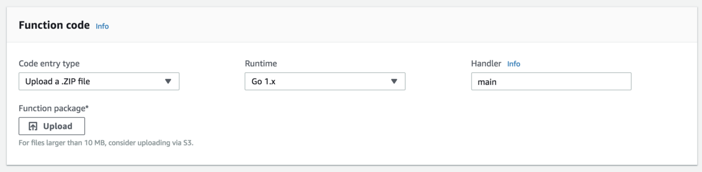
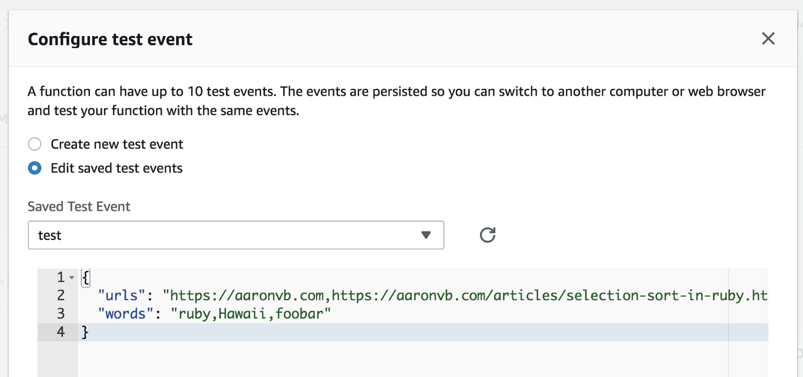
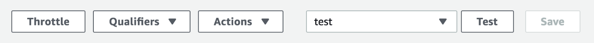

Recently I needed to know when certain websites were updated with specific text. I decided to utilize AWS Lambda to save on cost of hosting a server, and use Go because it’s fast, and also because it’s one of the supported languages on AWS Lambda. I am also using AWS SES to send me e-mail notifications when results are found.

Bellow I’ll be showing you how to compile the Go script, setup the AWS Lambda function, and configure a cron type job to run the script every hour.

First, clone the repo contains the script.

https://github.com/aaronvb/aws_lambda_go_scraper

```text
$ git clone git@github.com:aaronvb/aws_lambda_go_scraper.git
$ cd aws_lambda_go_scraper
```

Then we’ll build the Go script and zip it up for AWS Lambda.

```text
$ GOOS=linux GOARCH=amd64 go build -o main lambda_scraper.go
$ zip main.zip main
```

Create an AWS Lambda function with the Go runtime, and select or create a role that has access to AWS SES. We’ll be using AWS SES to send out the e-mail notification.

Once the AWS Lambda function is created, upload the zip file and make sure the handler is set to `main`.



Next, create 3 environment variables: `RECIPIENT` will be the email which receives the notification, `SENDER` which will be the email address that sends the notification, and last `SES_LOCATION` which is the location of your SES(ie: us-west-2).

[](../assets/simple-website-text-scraping-with-go-and-aws-lambda/env_variables.png)

Don’t forget to add the email address to SES and verify it so it can receive emails.

[](../assets/simple-website-text-scraping-with-go-and-aws-lambda/ses.png)

Now we can create a test event. In the event data pass a JSON hash which has a key `urls` and a string value with the urls you want to scrape, separated by commas, and a key `words`, with a string value of comma separated words you wish to scrape.

Example:

```json
{
  "urls": "https://aaronvb.com,https://aaronvb.com/articles/selection-sort-in-ruby.html",
  "words": "ruby,Hawaii,foobar"
}
```

[](../assets/simple-website-text-scraping-with-go-and-aws-lambda/test_event.png)

Click the test button and you should receive a successful function execution with logs and an email.

[](../assets/simple-website-text-scraping-with-go-and-aws-lambda/test_action.png)

The logs will contain the results, message ID from SES, and any errors while parsing or sending the email.

[](../assets/simple-website-text-scraping-with-go-and-aws-lambda/email_example.png)

*Success. The websites were scraped and my words were found!*

## Let’s Automate This
Now that the AWS Lambda function is working, it’s time to automate this and have it run every hour. We’ll pick different words because we know those exist. Let’s pretend we want to know when my personal website will be updated with the words “swift, java, and angular.”

For this we’ll be using AWS CloudWatch events. So let’s head over there and create a new events rule.

[](../assets/simple-website-text-scraping-with-go-and-aws-lambda/create_rule.png)

First we set the schedule to a fixed rate of 1 hour. Next, choose the Lambda function we created earlier. And finally, the most important part, select Configure input > Constant (JSON text), and paste in the JSON with the data to send to our function (see code below).

```json
{
  "urls": "https://aaronvb.com",
  "words": "swift,java,angular"
}
```

Once you fill that in, click Configure details to name the rule and then create it. We now have the script running every hour, scraping our website, searching for the text we provided, and alerting us when it finds it.