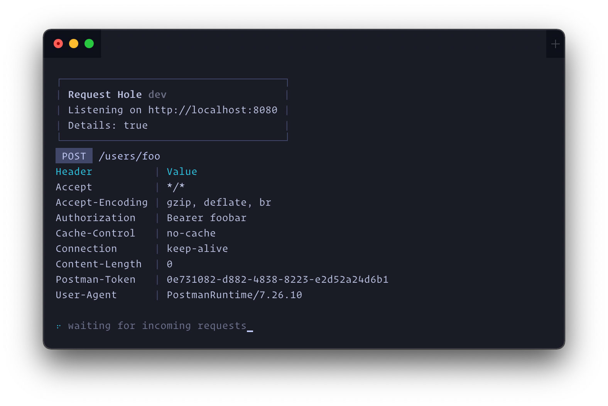
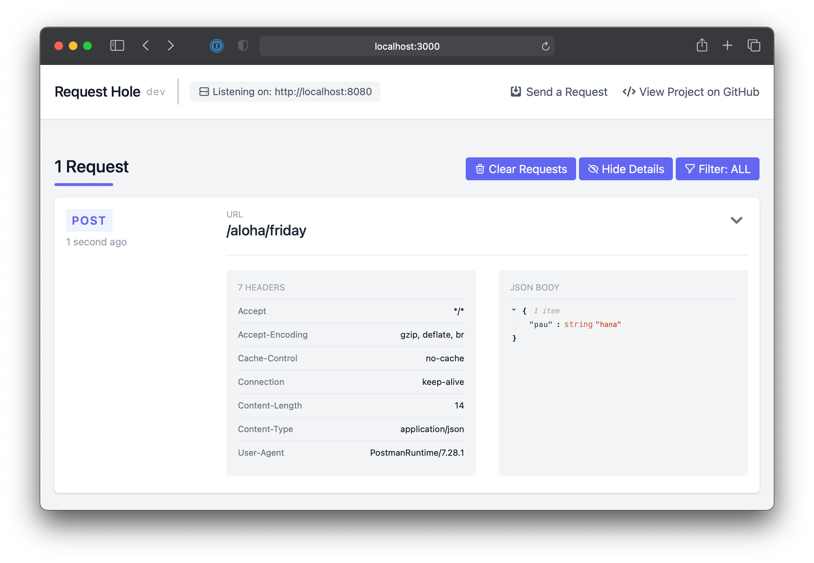

I've been working on a few side projects where I needed to inspect webhooks and initially used RequestBin to do this. However, I had issues with their service being down a few times and had some concerns about privacy. The alternative CLI tools I found required language dependencies and were a bit of a hassle to set up.

This felt like a good excuse to make a CLI tool in Go, which would require no dependencies or versions of languages; just compile, or download, the executable for your operating system.

My initial goal for the tool was to expose an endpoint and print incoming requests to the terminal output and/or write to a log file. This was the first release of [Request Hole](https://github.com/aaronvb/request_hole). (Also known as `rh`, which is the CLI executable.)

Building the first release was relatively straight forward. It was working great and with the help of [pterm](https://pterm.sh/) I was able to make the terminal output look modern. I later realized it would be a bit more useful to have a web interface that could show me the incoming requests, in real time, similar to RequestBin.

This required a lot of refactoring as the architecture at that point didn't support having two Goroutines (http servers in our case, one for the incoming requests and one to serve the web UI) running in parallel.

From the very beginning I wanted Request Hole to have an interface for outputs called `renderers` that could be implemented by any renderer we want to add. This could be a terminal printer, a log writer, or a web UI. To add the web UI, I had to change the way renderers were called, which at the time was synchronous, and decided to move them into individual Goroutines where they could be run in parallel.

By moving the renderers to Go routines, they needed a way to communicate with the incoming request endpoint so I utilized channels. I then moved all the renderer logic into a higher level function that manages all the Goroutines and channels.

After the big refactor, the next step was to start serving the web UI. I decided on [create-react-app](https://github.com/facebook/create-react-app) which provided mostly everything I needed to start building the front-end. Thankfully Go introduced the embed feature in 1.16 which made embedding and serving the front-end static files easy.

The next big decision was to use GraphQL instead of a standard REST API. Pushing incoming requests to the front-end through websockets was a requirement and I had read about GraphQL's subscriptions, so going with GraphQL felt like a good solution, and a fun experiment. Although not the easiest to setup, compared to a traditional REST API, and facing some weird quirks and nuances, I did manage to get all the plumbing sorted out with [gqlgen](https://github.com/99designs/gqlgen) and [Apollo](https://www.apollographql.com/).

One thing I learned was that mapping Go types to GraphQL types don't always, and most likely won't, work out. The solution to that is to create custom types using scalars and once I figured that out everything went swimmingly. After getting GraphQL sorted out all that was left to do was to create the UI. I decided on Tailwind so I didn't have to write any CSS.

You can view the project at [https://github.com/aaronvb/request_hole](https://github.com/aaronvb/request_hole) where the source and release files are available to download.

If you're on a Mac, you can install it with `brew install aaronvb/request_hole/rh`.
